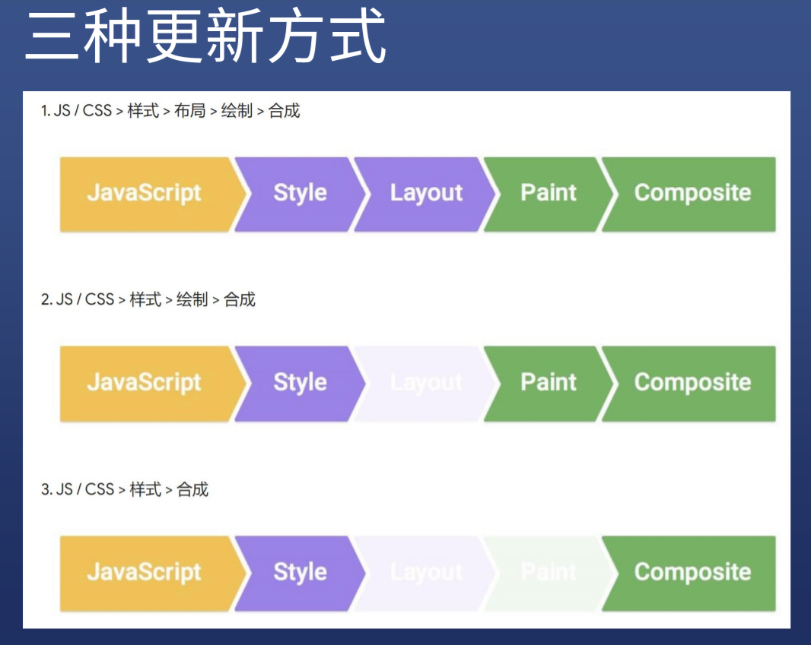
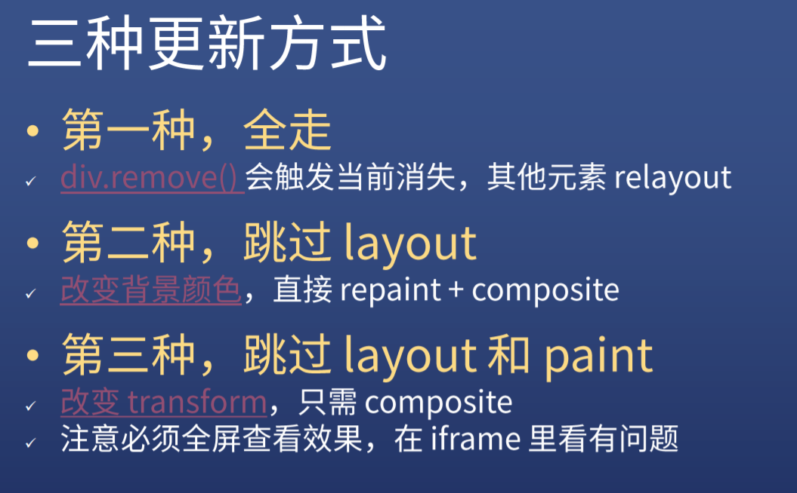
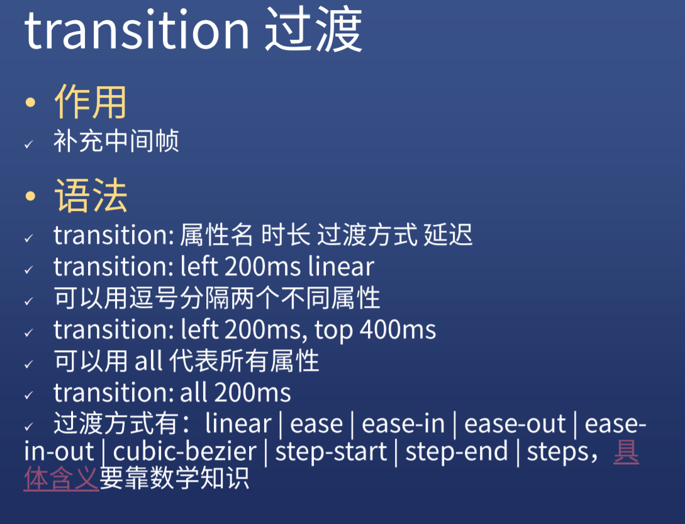
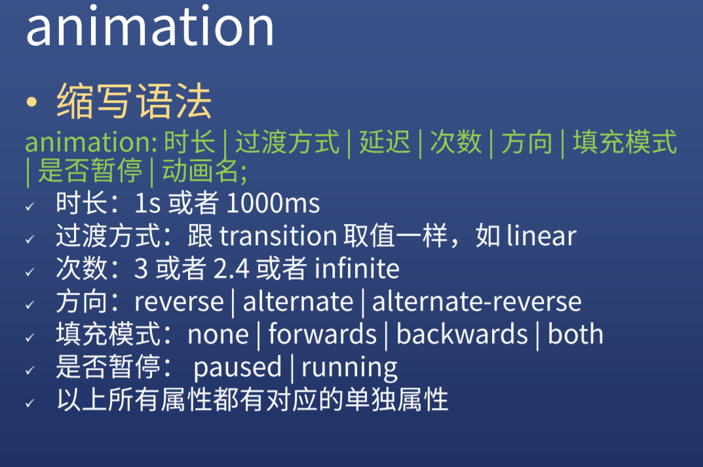
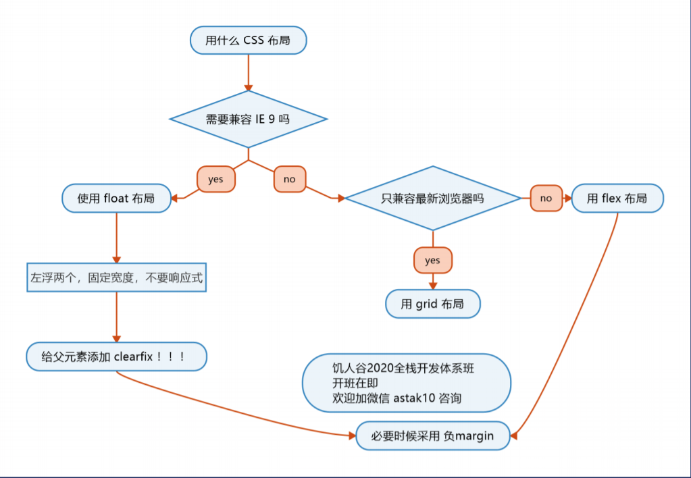

## 浏览器渲染原理
渲染步骤包括样式、布局、绘制，在某些情况下还包括合成。在解析步骤中创建的CSSOM树和DOM树组合成一个Render树，然后用于计算每个可见元素的布局，然后将其绘制到屏幕上。在某些情况下，可以将内容提升到它们自己的层并进行合成。
Style（样式）→Layout（布局）→Paint（绘制）→Compositing（合成）

每个标签的改动走的流程都不一样，可以通过下面这个网址查询到不同标签在不同浏览器上面的渲染流程
 
https://csstriggers.com/

 

## CSS 动画的两种做法（transition 和 animation）

1. transition
   
   transition: 属性 动画过程的秒数 变化的模式 几秒后开始动画
   
   *注意：不是所有的属性都能过渡
   display:none => block 不能过渡

   ~~~html
    transition: width 2s ease 3s;
   ~~~

    
 

2. animation
   

   ~~~html
   .heart{
            
            animation: heart .5s infinite alternate;
        }
        
        @keyframes heart{
            0%{
                transform: scale(1);
            }
            100%{
                transform: scale(1.2);
            }
    ~~~
 

## css常见的三种布局方式

   
* ## float
  ~~~html
  

    <header class="clearfix">
        <ul class="nav clearfix">
            <li>首页</li>
            <li>课程</li>
            <li>优惠</li>
            <li>关于</li>
        </ul>

        

            
        

    </header>
    

        <aside></aside>
        <main></main>
        

    

    

        

            

            

            

            

            

        

        
    

    ~~~

    ### 注意事项
    * 在浮动元素的父元素上一定要加.clearfix
        ~~~html
          .clearfix::after{
            content: '';
            display: block;
            clear: both;
        }
        ~~~

    * float布局不能用于手机上，只适合于网页布局
  

* ## flex
  ~~~html
  

    
        

          
        

        <ul class="nav">
            <li>首页</li>
            <li>课程</li>
            <li>优惠</li>
            <li>关于</li>
        </ul>
    
    

        <aside></aside>
        <main></main>
        

    

    

        

            

            

            

            

            

            

            

        

        
    

    ~~~

    ### 常用的属性
    * display:flex;
    * flex-direction:row/row-reverse/column/column-reverse
    * flex-raw:nowrap/wrap
    * justify-content:center/space-between/space-around
    * align-items:center

 
声明：所有图片均来自饥人谷